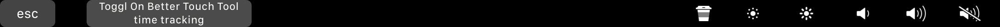

# Better Touch Tool Extensions

## [toggl.py](./toggl.py)



Given a user token as command line argument the script makes a request to the Toggl API for the current task. If it finds a task it prints the task's project name and description. If no description is set, the user is made aware of that.

By using the script as a better touch tool widget one is able to easily be aware of if a and if so what timer is currently active. Its easy to setup such that touching the widget allows one to edit the active timer through the Toggl Desktop software and/or to start a new timer by long pressing the button.

Copy and paste the following JSON snippet into Better Touch Tool's Touch Bar interface..

Copy/paste the following snippet into Better Touch Tool. Insert the python3 path (and make sure that the required dependencies are installed), the path to the toggl.py and toggl24.py script and your personal toggl token.

```JSON
{
  "BTTWidgetName" : "Toggl Current",
  "BTTTriggerType" : 642,
  "BTTTriggerTypeDescription" : "Shell Script \/ Task Widget",
  "BTTTriggerClass" : "BTTTriggerTypeTouchBar",
  "BTTPredefinedActionType" : 128,
  "BTTPredefinedActionName" : "Send Shortcut to Specific App",
  "BTTShortcutApp" : "\/Applications\/TogglDesktop.app",
  "BTTShortcutAppUnderCursor" : "com.toggl.toggldesktop.TogglDesktop",
  "BTTShortcutToSend" : "55,14",
  "BTTShellScriptWidgetGestureConfig" : "{{PATH/TO/VENV/PYTHON3}}:::{{PATH/TO/THIS/SCRIPT/toggl.py {{TOGGLTOKEN}}",
  "BTTEnabled2" : 1,
  "BTTEnabled" : 1,
  "BTTOrder" : 0,
  "BTTTriggerConfig" : {
    "BTTTouchBarItemIconHeight" : 22,
    "BTTTouchBarItemIconWidth" : 22,
    "BTTTouchBarItemPadding" : 0,
    "BTTTouchBarFreeSpaceAfterButton" : "5.000000",
    "BTTTouchBarButtonColor" : "75.323769, 75.323769, 75.323769, 255.000000",
    "BTTTouchBarAlwaysShowButton" : "0",
    "BTTTouchBarAlternateBackgroundColor" : "128.829533, 128.829533, 128.829533, 255.000000",
    "BTTTouchBarScriptUpdateInterval" : 9.7412004470825195,
    "BTTTouchBarLongPressActionName" : "toggl-new"
  }
}
```

To make the long press action work you will also need to add the following named trigger to Better Touch Tool. After pasting it into the *others* tab of BTT make sure that it is actually a named trigger named `toggl-new` for the above widget to pick it up.

```JSON
{
  "BTTTriggerType" : 643,
  "BTTTriggerTypeDescription" : "Named Trigger: toggl-new",
  "BTTTriggerClass" : "BTTTriggerTypeOtherTriggers",
  "BTTPredefinedActionType" : 128,
  "BTTPredefinedActionName" : "Send Shortcut to Specific App",
  "BTTShortcutApp" : "\/Applications\/TogglDesktop.app",
  "BTTShortcutAppUnderCursor" : "com.toggl.toggldesktop.TogglDesktop",
  "BTTShortcutToSend" : "55,45",
  "BTTTriggerName" : "toggl-new",
  "BTTEnabled2" : 1,
  "BTTEnabled" : 1,
  "BTTOrder" : 0
}
```
